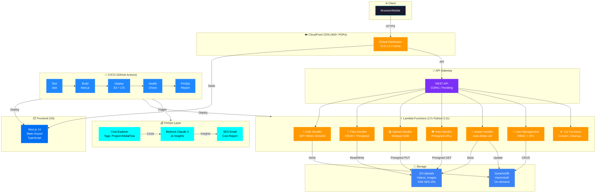

```mermaid
flowchart TB
    subgraph CLIENT["🌐 Client"]
        Browser["Browser/Mobile"]
    end

    subgraph CDN["☁️ CloudFront CDN (400+ POPs)"]
        CF["Global Distribution<br/>TLS 1.3 | Cache"]
    end

    subgraph FRONTEND["📦 Frontend (S3)"]
        S3F["Next.js 14<br/>Static Export<br/>TypeScript"]
    end

    subgraph API["🔌 API Gateway"]
        APIGW["REST API<br/>CORS | Throttling"]
    end

    subgraph COMPUTE["⚡ Lambda Functions (17x Python 3.11)"]
        AUTH["🔐 Auth Handler<br/>JWT HMAC-SHA256"]
        FILES["📁 Files Handler<br/>CRUD + Presigned"]
        UPLOAD["📤 Upload Handler<br/>Multipart 5GB"]
        VIEW["👁️ View Handler<br/>Presigned URLs"]
        AVATAR["👤 Avatar Handler<br/>Auto-delete old"]
        USERS["👥 User Management<br/>RBAC + 2FA"]
        OTHER["⚙️ +11 Functions<br/>Convert, Cleanup..."]
    end

    subgraph STORAGE["💾 Storage"]
        S3U["S3 Uploads<br/>Videos, Images<br/>SSE AES-256"]
        DDB["DynamoDB<br/>Users/Auth<br/>On-demand"]
    end

    subgraph FINOPS["💰 FinOps Layer"]
        CE["Cost Explorer<br/>Tags: Project=MidiaFlow"]
        BEDROCK["Bedrock Claude 3<br/>AI Insights"]
        SES["SES Email<br/>Cost Report"]
    end

    subgraph CICD["🚀 CI/CD (GitHub Actions)"]
        direction LR
        TEST["Test<br/>Jest"] --> BUILD["Build<br/>Next.js"]
        BUILD --> DEPLOY["Deploy<br/>S3 + 17λ"]
        DEPLOY --> HEALTH["Health<br/>Check"]
        HEALTH --> FIN["FinOps<br/>Report"]
    end

    Browser -->|HTTPS| CF
    CF -->|Static| S3F
    CF -->|API| APIGW
    APIGW --> AUTH
    APIGW --> FILES
    APIGW --> UPLOAD
    APIGW --> VIEW
    APIGW --> AVATAR
    APIGW --> USERS
    APIGW --> OTHER
    AUTH -->|Verify| DDB
    FILES -->|Read/Write| S3U
    UPLOAD -->|Presigned PUT| S3U
    VIEW -->|Presigned GET| S3U
    AVATAR -->|Store| S3U
    AVATAR -->|Update| DDB
    USERS -->|CRUD| DDB
    CE -->|Costs| BEDROCK
    BEDROCK -->|Insights| SES
    CICD -->|Deploy| S3F
    CICD -->|Deploy| COMPUTE
    CICD -->|Trigger| FINOPS

    classDef client fill:#1a1a2e,stroke:#00ffff,color:#fff
    classDef cdn fill:#FF9900,stroke:#FF9900,color:#fff
    classDef frontend fill:#0070f3,stroke:#0070f3,color:#fff
    classDef api fill:#7b2ff7,stroke:#7b2ff7,color:#fff
    classDef compute fill:#FF9900,stroke:#FF9900,color:#fff
    classDef storage fill:#3b82f6,stroke:#3b82f6,color:#fff
    classDef finops fill:#00ffff,stroke:#00ffff,color:#000
    classDef cicd fill:#2088FF,stroke:#2088FF,color:#fff

    class Browser client
    class CF cdn
    class S3F frontend
    class APIGW api
    class AUTH,FILES,UPLOAD,VIEW,AVATAR,USERS,OTHER compute
    class S3U,DDB storage
    class CE,BEDROCK,SES finops
    class TEST,BUILD,DEPLOY,HEALTH,FIN cicd
```
